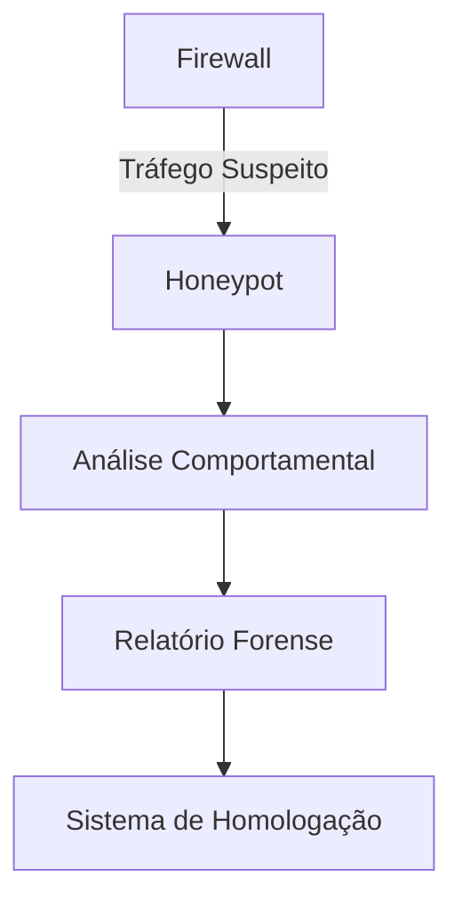
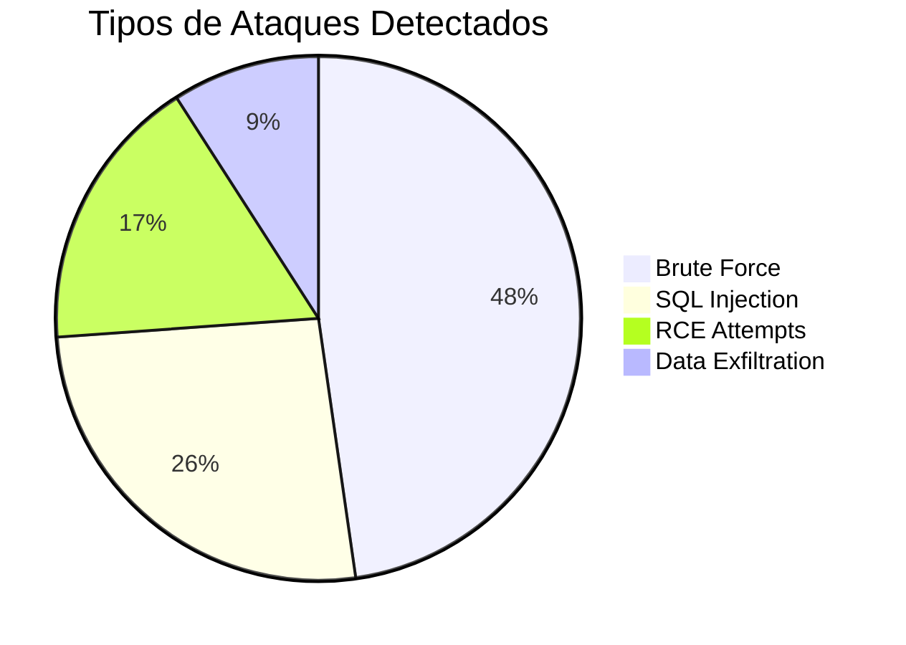

# Sistema Honeypot Integrado

## 🌐 Visão Geral



Este módulo implementa um honeypot de alta interação para captura e análise de atividades maliciosas, integrado diretamente com o sistema de homologação.

## 🛠️ Componentes Principais

### 🐋 Container de Serviços Vulneráveis
- SSH server com credenciais fracas
- FTP server com vulnerabilidade conhecida
- Serviço HTTP fake com formulários de login
- Banco de dados MySQL vulnerável

### 🔍 Módulo de Análise
- Detecção de padrões de ataque
- Gravação de sessões (keystroke logging)
- Análise de payloads
- Detecção de scanners automáticos

## 📦 Estrutura do Projeto

```
honeypot/
├── docker/
│   ├── ssh/
│   ├── ftp/
│   ├── http/
│   └── mysql/
├── src/
│   ├── monitor.rs
│   ├── analyzer.rs
│   └── reporter.rs
├── config/
│   ├── services.toml
│   └── credentials.toml
└── scripts/
    ├── deploy.sh
    └── rotate_credentials.sh
```

## 🚀 Implementação

### 1. Construção dos Containers

```bash
# Construir todos os serviços
docker-compose build

# Iniciar apenas serviços específicos
docker-compose up ssh http
```

### 2. Configuração

Edite `config/services.toml`:

```toml
[ssh]
port = 2222
banner = "SSH-2.0-OpenSSH_7.9p1"

[ftp]
max_connections = 50
fake_files = ["secret.txt", "passwords.doc"]

[http]
phishing_pages = [
    { path = "/login", title = "Admin Portal" },
    { path = "/wp-admin", title = "WordPress Login" }
]
```

### 3. Monitoramento

```rust
// Exemplo de captura de sessão SSH
fn capture_session(session: SshSession) {
    let mut logger = SessionLogger::new();
    logger.record_keystrokes(&session);
    logger.record_commands(&session);
    
    if let Some(exploit) = detect_exploit(&session) {
        alert_soc(&exploit);
    }
}
```

## 🔍 Análise de Ameaças

O sistema detecta automaticamente:

- Tentativas de brute force
- Exploração de vulnerabilidades conhecidas
- Comandos maliciosos típicos
- Padrões de exfiltração de dados



## 📊 Relatórios Forenses

Exemplo de saída:

```markdown
# Relatório de Ameaça - 2023-08-20

- **IP Origem**: 192.168.1.100
- **Serviço Alvo**: SSH (2222)
- **Tipo de Ataque**: Bruteforce
- **Credenciais Testadas**: 243
- **Padrões Detectados**:
  - Comando suspeito: `rm -rf /`
  - Tentativa de escalação de privilégios
```

## ⚙️ Integração com Homologação

Configure em `config/homologation.toml`:

```toml
[integration]
homologation_server = "http://homologador:8080"
alert_threshold = "high"

[actions]
quarantine = true
collect_evidence = true
```

## 🛡️ Melhores Práticas de Segurança

1. **Isolamento de Rede**:
   ```bash
   docker network create --internal honeypot_net
   ```

2. **Rotação de Credenciais**:
   ```bash
   ./scripts/rotate_credentials.sh --interval 4h
   ```

3. **Armazenamento Seguro**:
   ```bash
   openssl enc -aes-256-cbc -in sessions.log -out sessions.enc
   ```

## 📌 Exemplo de Uso

```rust
// Enviar alerta para o SOC
fn alert_soc(event: &SecurityEvent) {
    let report = create_report(event);
    send_to_homologation(report);
    notify_slack(&format!("Nova ameaça detectada: {}", event.threat_type));
}
```

## ⚠️ Avisos Importantes

1. Nunca exponha o honeypot diretamente na internet
2. Monitore o consumo de recursos
3. Revise regularmente os logs capturados
4. Mantenha os containers atualizados

## 🤝 Contribuição

Para adicionar novos serviços vulneráveis:

1. Crie uma nova pasta em `docker/`
2. Implemente o Dockerfile
3. Adicione configuração em `config/services.toml`
4. Submeta via Pull Request

## 📄 Licença

GPLv3 - Veja [LICENSE](LICENSE) para detalhes.

---

**Nota**: Este sistema deve ser utilizado apenas para pesquisa de segurança autorizada.