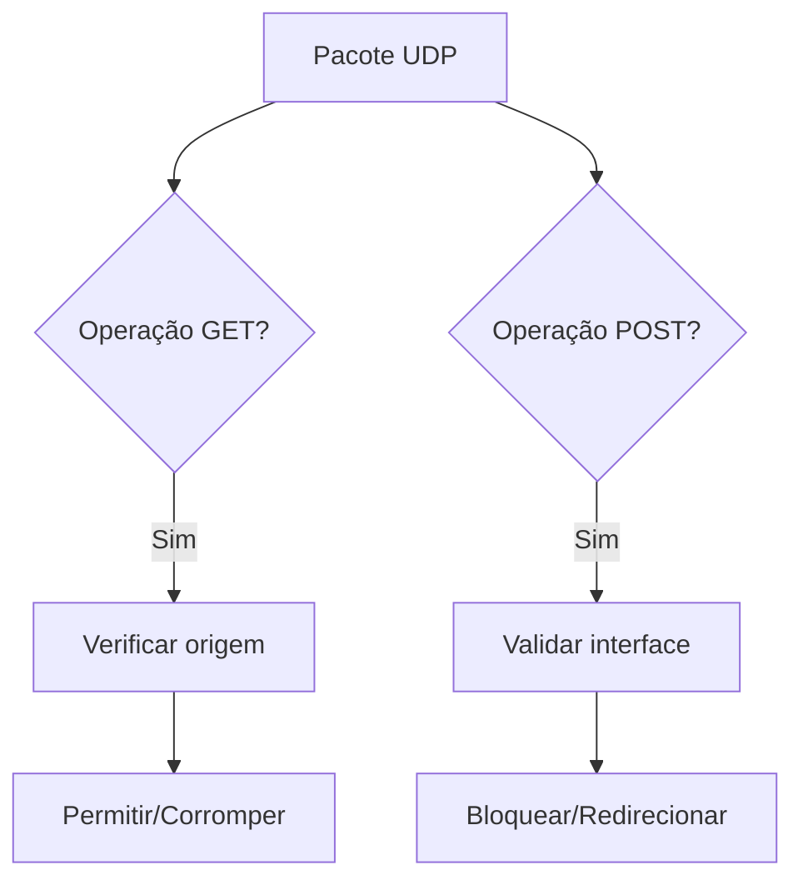
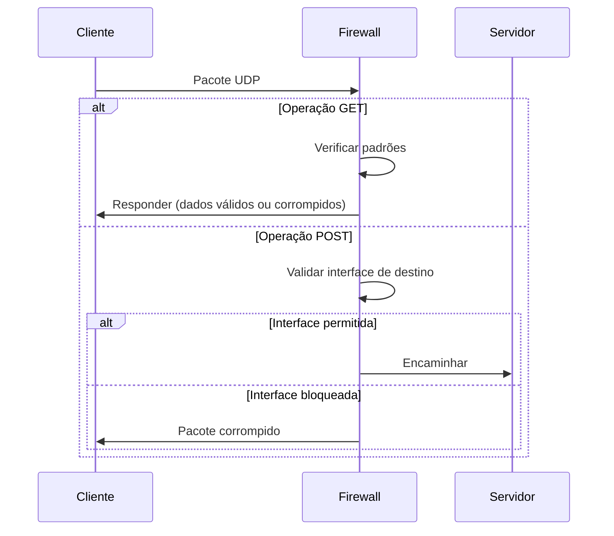

# Firewall UDP Avançado

## 🌐 Visão Geral do Sistema

Baseado na estrutura do repositório GitHub, este módulo UDP oferece proteção especializada para comunicações baseadas no protocolo UDP, com foco em operações GET e POST simuladas.

## 📁 Estrutura do Projeto (UDP)

```
firewall/
├── Protocols/
│   ├── UDP/
│   │   ├── GET.rs       # Implementação de filtros para requisições tipo GET
│   │   ├── POST.rs      # Implementação de filtros para requisições tipo POST  
│   │   ├── sever.rs     # Servidor UDP principal
│   │   └── README.md    # Documentação específica do UDP
```

## 🛡️ Funcionalidades Principais

### 🔥 Filtragem UDP Avançada
| Módulo | Funcionalidade | Descrição |
|--------|---------------|-----------|
| `GET.rs` | Análise de requisições | Detecta e filtra padrões GET maliciosos |
| `POST.rs` | Validação de dados | Bloqueia POSTs para interfaces não autorizadas |
| `sever.rs` | Gerenciamento de conexões | Implementa proteção contra flood |

## 🔍 Mecanismos Especiais UDP



## ⚙️ Configuração UDP

Exemplo de regras em `rules.json`:
```json
{
  "udp_rules": {
    "allowed_interfaces": ["eth0", "vpn0"],
    "get_protection": {
      "max_requests_per_second": 100,
      "spoof_responses": true
    },
    "post_protection": {
      "data_corruption": {
        "enabled": true,
        "patterns": ["token=", "password="]
      }
    }
  }
}
```

## 🚀 Implementação e Uso

1. **Compilação**:
```bash
cd firewall/Protocols/UDP
cargo build --features="advanced-protection"
```

2. **Execução**:
```bash
./target/release/sever --config ../Rules/rules.json
```

3. **Testes**:
```bash
cargo test --test udp_security_tests
```

## 📌 Casos de Uso Específicos

1. **Proteção contra exfiltração**:
   - Bloqueio de POSTs não autorizados
   - Corrupção de dados sensíveis

2. **Defesa contra enumeração**:
   - Respostas espúrias para requisições GET
   - Rate limiting adaptativo

3. **Proteção contra flood**:
   - Limitação de pacotes por segundo
   - Detecção de padrões anômalos

## 🔄 Fluxo de Trabalho Recomendado



## 🤝 Contribuição

Para contribuir com o módulo UDP:
1. Edite os arquivos em `Protocols/UDP/`
2. Atualize os testes em `Test/`
3. Documente mudanças no `README.md`
4. Envie um Pull Request

---

**Nota Técnica**: Devido à natureza connectionless do UDP, recomenda-se:
- Monitoramento constante de tráfego
- Atualizações frequentes das regras
- Combinação com outros mecanismos de segurança

## 🚀 Como Usar

### Requisição UDP GET:
```rust
use firewall::Protocols::UDP::get;

fn main() -> std::io::Result<()> {
    get::execute_udp_get("127.0.0.1:8080", "api.example.com", "/data", 5)?;
    Ok(())
}
```

### Requisição UDP POST:
```rust
use firewall::Protocols::UDP::post;

fn main() -> std::io::Result<()> {
    post::execute_udp_post(
        "127.0.0.1:8080", 
        "api.example.com", 
        "/submit", 
        "user=test&data=123", 
        5
    )?;
    Ok(())
}
```

## 🔍 Saída de Exemplo (UDP POST)

```
🚀 Enviando UDP POST para 127.0.0.1:8080 (32 bytes)

📥 Resposta recebida em 12.345ms
🔍 Análise Detalhada do Pacote UDP POST (64 bytes)
------------------------------------------------------------
🌐 Origem: 127.0.0.1:8080

📝 Estrutura POST:
   Path: /submit
   Host: api.example.com
   Data: 14 bytes

📊 Conteúdo dos Dados:
Offset    Binário        Hex      Decimal   ASCII
--------  --------       --      -------   -----
00000000  01110101       75       117       u
00000001  01110011       73       115       s
00000002  01100101       65       101       e
...
```

## ✨ Recursos Implementados

1. **Geração de Pacotes**:
   - GET com formato otimizado
   - POST com separação clara de metadados e dados

2. **Análise Profunda**:
   - Visualização em hexadecimal, binário e decimal
   - Interpretação de estrutura de pacotes
   - Análise de cabeçalho simulado

3. **Funcionalidades Avançadas**:
   - Timeout configurável
   - Bind automático em porta aleatória
   - Medição de tempo de resposta

4. **Segurança**:
   - Tratamento de erros robusto
   - Proteção contra buffer overflow
   - Validação de dados UTF-8
