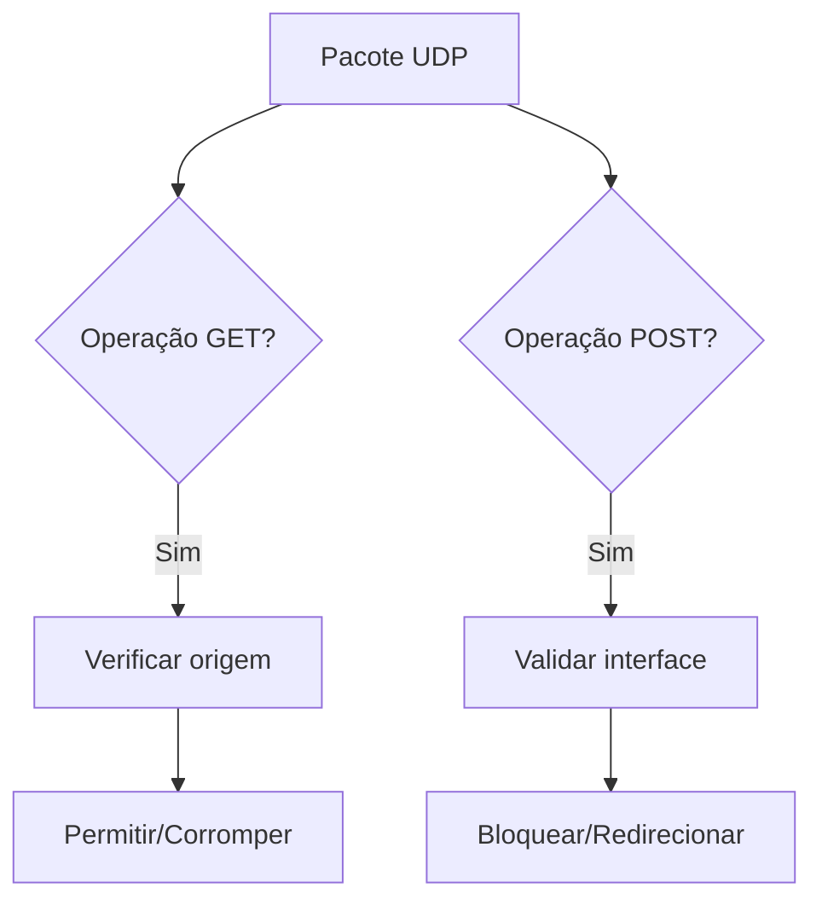
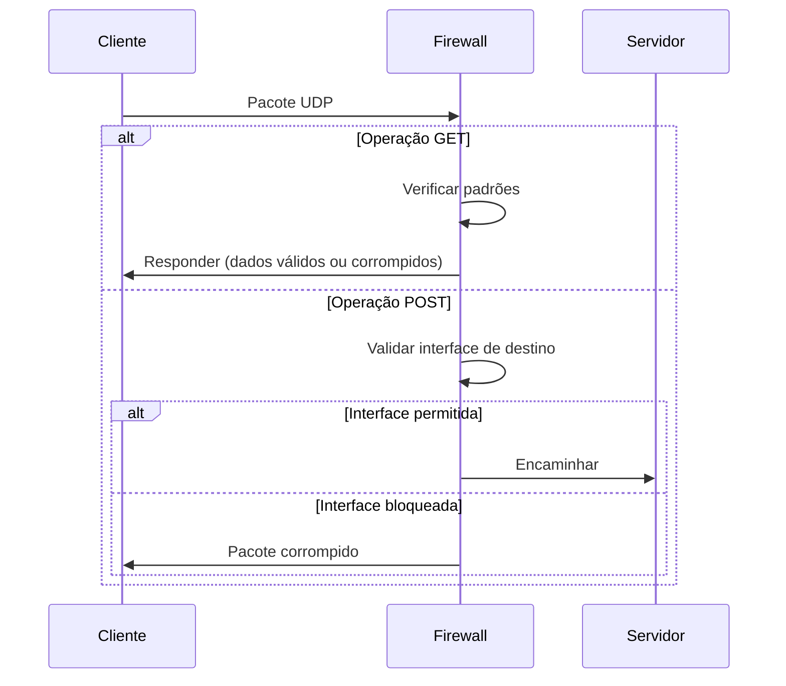

# Firewall UDP Avançado

## 🌐 Visão Geral do Sistema

Baseado na estrutura do repositório GitHub, este módulo UDP oferece proteção especializada para comunicações baseadas no protocolo UDP, com foco em operações GET e POST simuladas.

## 📁 Estrutura do Projeto (UDP)

```
firewall/
├── Protocols/
│   ├── UDP/
│   │   ├── GET.rs       # Implementação de filtros para requisições tipo GET
│   │   ├── POST.rs      # Implementação de filtros para requisições tipo POST  
│   │   ├── sever.rs     # Servidor UDP principal
│   │   └── README.md    # Documentação específica do UDP
```

## 🛡️ Funcionalidades Principais

### 🔥 Filtragem UDP Avançada
| Módulo | Funcionalidade | Descrição |
|--------|---------------|-----------|
| `GET.rs` | Análise de requisições | Detecta e filtra padrões GET maliciosos |
| `POST.rs` | Validação de dados | Bloqueia POSTs para interfaces não autorizadas |
| `sever.rs` | Gerenciamento de conexões | Implementa proteção contra flood |

## 🔍 Mecanismos Especiais UDP


```mermaid
graph TD
    A[Pacote UDP] --> B{Operação GET?}
    A --> C{Operação POST?}
    B -->|Sim| D[Verificar origem]
    C -->|Sim| E[Validar interface]
    D --> F[Permitir/Corromper]
    E --> G[Bloquear/Redirecionar]
```

## ⚙️ Configuração UDP

Exemplo de regras em `rules.json`:
```json
{
  "udp_rules": {
    "allowed_interfaces": ["eth0", "vpn0"],
    "get_protection": {
      "max_requests_per_second": 100,
      "spoof_responses": true
    },
    "post_protection": {
      "data_corruption": {
        "enabled": true,
        "patterns": ["token=", "password="]
      }
    }
  }
}
```

## 🚀 Implementação e Uso

1. **Compilação**:
```bash
cd firewall/Protocols/UDP
cargo build --features="advanced-protection"
```

2. **Execução**:
```bash
./target/release/sever --config ../Rules/rules.json
```

3. **Testes**:
```bash
cargo test --test udp_security_tests
```

## 📌 Casos de Uso Específicos

1. **Proteção contra exfiltração**:
   - Bloqueio de POSTs não autorizados
   - Corrupção de dados sensíveis

2. **Defesa contra enumeração**:
   - Respostas espúrias para requisições GET
   - Rate limiting adaptativo

3. **Proteção contra flood**:
   - Limitação de pacotes por segundo
   - Detecção de padrões anômalos

## 🔄 Fluxo de Trabalho Recomendado


```mermaid
sequenceDiagram
    Cliente->>Firewall: Pacote UDP
    alt Operação GET
        Firewall->>Firewall: Verificar padrões
        Firewall->>Cliente: Responder (dados válidos ou corrompidos)
    else Operação POST
        Firewall->>Firewall: Validar interface de destino
        alt Interface permitida
            Firewall->>Servidor: Encaminhar
        else Interface bloqueada
            Firewall->>Cliente: Pacote corrompido
        end
    end
```

## 🤝 Contribuição

Para contribuir com o módulo UDP:
1. Edite os arquivos em `Protocols/UDP/`
2. Atualize os testes em `Test/`
3. Documente mudanças no `README.md`
4. Envie um Pull Request

---

**Nota Técnica**: Devido à natureza connectionless do UDP, recomenda-se:
- Monitoramento constante de tráfego
- Atualizações frequentes das regras
- Combinação com outros mecanismos de segurança