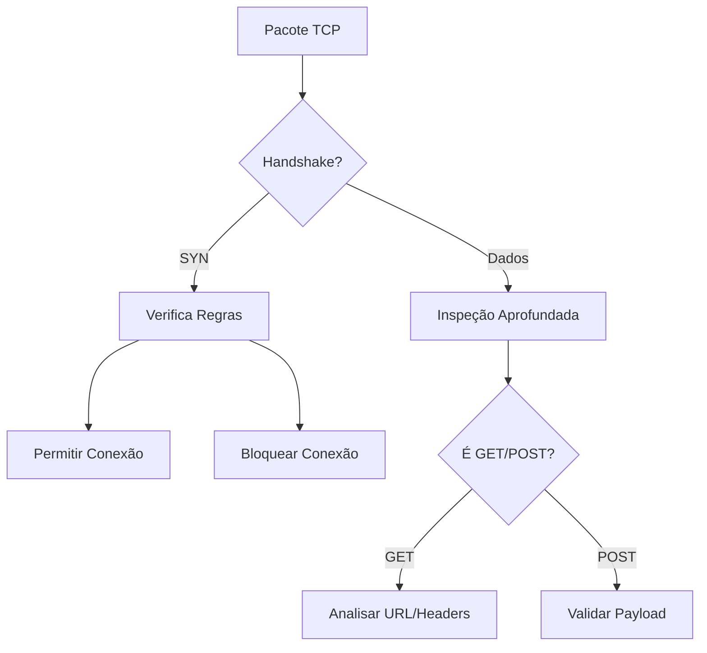
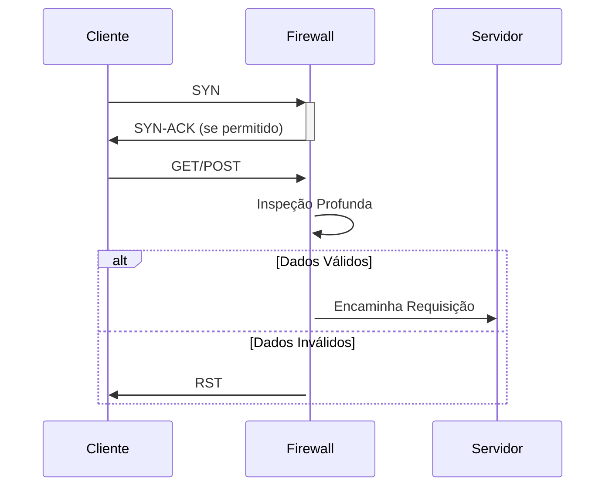

# Firewall TCP Avançado

## 🌐 Visão Geral do Sistema

Baseado na estrutura do repositório GitHub, este módulo TCP oferece proteção avançada para comunicações baseadas no protocolo TCP, com foco especial em operações GET e POST.

## 📁 Estrutura do Projeto (TCP)

```
firewall/
├── Protocols/
│   ├── TCP/
│   │   ├── GET.rs       # Implementação de filtros para requisições GET
│   │   ├── POST.rs      # Implementação de filtros para requisições POST  
│   │   ├── sever.rs     # Servidor TCP principal
│   │   └── README.md    # Documentação específica do TCP
```

## 🛡️ Funcionalidades Principais

### 🔥 Filtragem TCP Avançada
| Módulo | Funcionalidade | Descrição |
|--------|---------------|-----------|
| `GET.rs` | Análise de requisições | Filtra requisições GET maliciosas |
| `POST.rs` | Validação de dados | Verifica integridade de payloads POST |
| `sever.rs` | Gerenciamento de conexões | Implementa handshake seguro |

## 🔍 Análise Profunda de Pacotes TCP



## ⚙️ Configuração TCP

Exemplo de regras em `rules.json`:
```json
{
  "tcp_rules": {
    "allowed_ports": [80, 443, 22],
    "get_protection": {
      "max_url_length": 2048,
      "blocked_patterns": ["../", "exec("]
    },
    "post_protection": {
      "max_size": "10MB",
      "content_validation": true
    }
  }
}
```

## 🚀 Como Usar

1. **Compilação**:
```bash
cd firewall/Protocols/TCP
cargo build --release
```

2. **Execução**:
```bash
./target/release/sever -c rules.json
```

3. **Testes**:
```bash
cd ../Test
cargo test
```

## 📌 Melhores Práticas

1. **Para GET**:
   - Implemente validação rigorosa de URLs
   - Limite o tamanho de cabeçalhos
   - Monitore padrões de scraping

2. **Para POST**:
   - Valide Content-Type
   - Limite tamanho de payloads
   - Implemente CSRF protection

## 🔄 Fluxo de Trabalho



## 🤝 Contribuição

Para contribuir com o módulo TCP:
1. Edite os arquivos em `Protocols/TCP/`
2. Atualize os testes correspondentes
3. Envie um Pull Request

---

**Nota**: Este módulo trabalha em conjunto com a implementação UDP para proteção completa da camada de transporte.