# Firewall TCP Avançado

## 🌐 Visão Geral do Sistema

Baseado na estrutura do repositório GitHub, este módulo TCP oferece proteção avançada para comunicações baseadas no protocolo TCP, com foco especial em operações GET e POST.

## 📁 Estrutura do Projeto (TCP)

```
firewall/
├── Protocols/
│   ├── TCP/
│   │   ├── GET.rs       # Implementação de filtros para requisições GET
│   │   ├── POST.rs      # Implementação de filtros para requisições POST  
│   │   ├── sever.rs     # Servidor TCP principal
│   │   └── README.md    # Documentação específica do TCP
```

## 🛡️ Funcionalidades Principais

### 🔥 Filtragem TCP Avançada
| Módulo | Funcionalidade | Descrição |
|--------|---------------|-----------|
| `GET.rs` | Análise de requisições | Filtra requisições GET maliciosas |
| `POST.rs` | Validação de dados | Verifica integridade de payloads POST |
| `sever.rs` | Gerenciamento de conexões | Implementa handshake seguro |

## 🔍 Análise Profunda de Pacotes TCP

```mermaid
graph TD
    A[Pacote TCP] --> B{Handshake?}
    B -->|SYN| C[Verifica Regras]
    B -->|Dados| D[Inspeção Aprofundada]
    C --> E[Permitir Conexão]
    C --> F[Bloquear Conexão]
    D --> G{É GET/POST?}
    G -->|GET| H[Analisar URL/Headers]
    G -->|POST| I[Validar Payload]
```



## ⚙️ Configuração TCP

Exemplo de regras em `rules.json`:
```json
{
  "tcp_rules": {
    "allowed_ports": [80, 443, 22],
    "get_protection": {
      "max_url_length": 2048,
      "blocked_patterns": ["../", "exec("]
    },
    "post_protection": {
      "max_size": "10MB",
      "content_validation": true
    }
  }
}
```

## 🚀 Como Usar

1. **Compilação**:
```bash
cd firewall/Protocols/TCP
cargo build --release
```

2. **Execução**:
```bash
./target/release/sever -c rules.json
```

3. **Testes**:
```bash
cd ../Test
cargo test
```

## 📌 Melhores Práticas

1. **Para GET**:
   - Implemente validação rigorosa de URLs
   - Limite o tamanho de cabeçalhos
   - Monitore padrões de scraping

2. **Para POST**:
   - Valide Content-Type
   - Limite tamanho de payloads
   - Implemente CSRF protection

## 🔄 Fluxo de Trabalho

```mermaid
sequenceDiagram
    Cliente->>+Firewall: SYN
    Firewall->>-Cliente: SYN-ACK (se permitido)
    Cliente->>+Firewall: GET/POST
    Firewall->>Firewall: Inspeção Profunda
    alt Dados Válidos
        Firewall->>Servidor: Encaminha Requisição
    else Dados Inválidos
        Firewall->>Cliente: RST
    end
```



## 🤝 Contribuição

Para contribuir com o módulo TCP:
1. Edite os arquivos em `Protocols/TCP/`
2. Atualize os testes correspondentes
3. Envie um Pull Request

---

**Nota**: Este módulo trabalha em conjunto com a implementação UDP para proteção completa da camada de transporte.

---

## 🚀 Como Usar

### Para requisições GET:
```rust
use firewall::Protocols::TCP::get;

fn main() -> std::io::Result<()> {
    get::execute_get("example.com", 80, "/api/data")?;
    Ok(())
}
```

### Para requisições POST:
```rust
use firewall::Protocols::TCP::post;

fn main() -> std::io::Result<()> {
    post::execute_post("example.com", 80, "/api/submit", "user=test&data=123")?;
    Ok(())
}
```

## 🔍 Saída de Exemplo (GET)

```
🚀 Enviando GET para example.com/api/data
🔍 Análise Detalhada do Pacote (512 bytes)
-------------------------------------------
📦 Cabeçalho TCP:
🔢 Hexadecimal:
   45 00 00 34 12 34 00 00 40 06 00 00 7F 00 00 01 
   7F 00 00 01 
🔣 Binário:
   01000101
   00000000
   ...
🔢 Decimal:
   Byte 0: 69
   Byte 1: 0
   ...
📄 Dados HTTP:
HTTP/1.1 200 OK
Content-Type: application/json
...
```

## ✨ Recursos Implementados

1. **Geração de Requisições**:
   - GET com cabeçalhos padrão
   - POST com corpo personalizado

2. **Análise Profunda**:
   - Exibição em hexadecimal, binário e decimal
   - Identificação de flags TCP
   - Tradução ASCII com offsets

3. **Segurança**:
   - Timeouts configuráveis
   - Tratamento de erros robusto

4. **Extensibilidade**:
   - Fácil adição de novos cabeçalhos
   - Suporte para diferentes content types