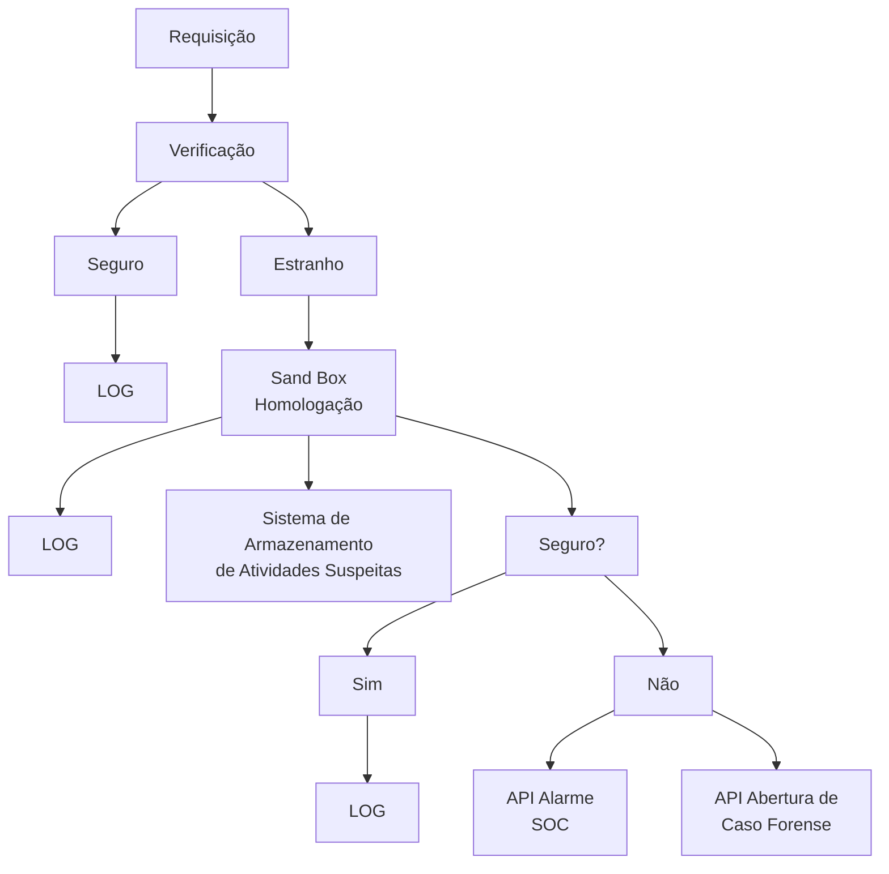

# Firewall & Security Topology System

## 📌 Visão Geral

Este projeto combina um firewall eficiente com um sistema de análise de segurança em camadas, protegendo redes contra ameaças através de filtragem de tráfego e análise comportamental em ambiente isolado.

## ✨ Funcionalidades Principais

### Firewall
- Filtragem de pacotes por IP, porta e protocolo
- Suporte para regras de entrada/saída (INPUT/OUTPUT)
- Bloqueio de portas vulneráveis
- Configuração simplificada via arquivo de regras
- Suporte a IPv4

### Sistema de Segurança
- Camadas de verificação de requisições
- Ambiente sandbox para análise de ameaças
- Integração com SOC (Security Operations Center)
- Registro completo de logs
- Armazenamento de dados de telemetria

## 🔧 Topologia do Sistema



### Fluxo de Processamento

1. **Entrada de Requisições**:
   - Todas as requisições são registradas em LOG
   - Envio de alertas para SOC quando necessário
   - Processamento principal através do firewall

2. **Camadas de Verificação**:
   - Verificação inicial pelas regras do firewall
   - Armazenamento de dados de telemetria
   - Análise comportamental para identificar ameaças

3. **Sandbox de Segurança**:
   - Requisições suspeitas são isoladas
   - Análise profunda em ambiente controlado
   - Decisão final: liberar ou bloquear

## 🛠️ Pré-requisitos

- Sistema Linux (Ubuntu/Debian recomendado)
- iptables instalado
- Python 3.x (para módulos de análise)
- 2GB+ RAM (para operação do sandbox)
- Acesso root/sudo

## ⚙️ Instalação

```bash
git clone https://github.com/morteerror404/firewall.git
cd firewall
chmod +x install.sh
sudo ./install.sh
```

## 📝 Configuração

1. **Firewall**:
   Edite `rules.conf` no formato:
   ```
   [chain] [protocol] [port] [action] [source]
   ```

2. **Sistema de Segurança**:
   Configure parâmetros em `security_config.ini`:
   ```ini
   [sandbox]
   memory_limit = 512MB
   timeout = 30s
   
   [soc]
   api_endpoint = https://soc.example.com/alerts
   ```

## 🚀 Como Usar

```bash
# Iniciar sistema completo
sudo ./start_system.sh

# Visualizar logs
sudo ./log_viewer.sh

# Testar sandbox
sudo ./test_sandbox.sh sample_request.json
```

## 📊 Regras Padrão

| Porta | Protocolo | Ação      | Descrição               |
|-------|-----------|-----------|-------------------------|
| 22    | TCP       | ACCEPT    | SSH (apenas redes locais)|
| 80    | TCP       | ACCEPT    | HTTP                    |
| 443   | TCP       | ACCEPT    | HTTPS                   |
| *     | ICMP      | DROP      | Bloqueio de ping        |
| *     | *         | REJECT    | Política padrão         |

## 🤝 Contribuição

1. Faça um fork do projeto
2. Crie sua branch (`git checkout -b feature/nova-feature`)
3. Commit suas mudanças (`git commit -m 'Add new feature'`)
4. Push para a branch (`git push origin feature/nova-feature`)
5. Abra um Pull Request

## 📄 Licença

MIT License - Veja [LICENSE](LICENSE) para detalhes.

## ⚠️ Aviso de Segurança

Este sistema modifica configurações críticas de rede. Sempre:
- Teste em ambiente controlado antes de produção
- Mantenha backups das configurações originais
- Monitore os logs após implementação
