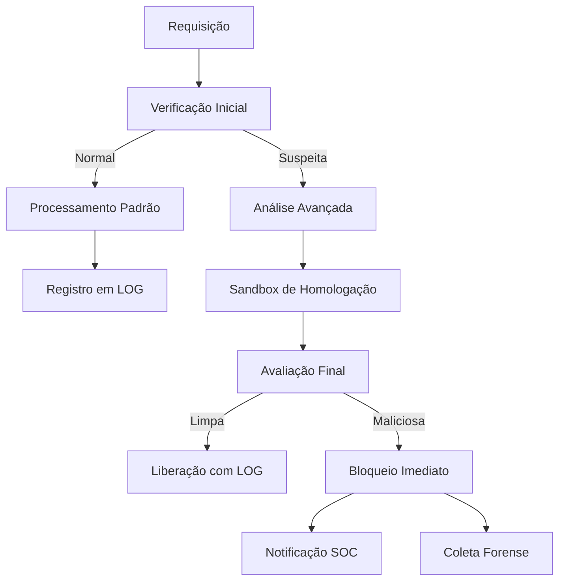

# Sistema Avançado de Firewall e Análise de Segurança

## 🌐 Visão Geral do Sistema

Este projeto integra um firewall de última geração com um sofisticado sistema de análise de ameaças, oferecendo:

- Proteção em tempo real contra ameaças conhecidas e desconhecidas
- Análise comportamental avançada em ambiente isolado
- Integração completa com SOC (Security Operations Center)
- Coleta forense automatizada para investigação pós-incidente

## 🛡️ Funcionalidades Principais

### 🔥 Firewall Inteligente
| Feature | Descrição |
|---------|-----------|
| Filtro Multidimensional | Analisa IP, porta, protocolo e padrões de tráfego |
| Aprendizado Contínuo | Adapta-se a novos padrões de ataque automaticamente |
| Proteção em Camadas | Defesa em profundidade com múltiplos níveis de verificação |
| Dashboard em Tempo Real | Visualização imediata de ameaças bloqueadas |

### 🕵️ Sistema de Análise de Ameaças


## 🚀 Implementação

### 📋 Requisitos Técnicos
- **Hardware Mínimo**:
  - 4 vCPUs
  - 8GB RAM
  - 50GB SSD (Para armazenamento de logs)

- **Software**:
  - Ubuntu 22.04 LTS / Debian 11+
  - Python 3.9+
  - Docker CE (Para isolamento sandbox)
  - Elastic Stack (Opcional para análise de logs)

### 🛠️ Instalação Automatizada
```bash
# Clone o repositório
git clone --depth 1 https://github.com/morteerror404/firewall.git
cd firewall

# Execute o instalador inteligente
sudo ./install.sh --with-sandbox --with-monitoring

# Verifique a instalação
sudo ./healthcheck.sh
```

## ⚙️ Configuração Avançada

### 🔧 Arquivo de Regras (YAML Format)
```yaml
rules:
  - name: "Proteção SSH"
    chain: INPUT
    protocol: tcp
    port: 22
    action: ACCEPT
    source: 192.168.1.0/24
    log: true

  - name: "Bloqueio Ransomware"
    pattern: "*.locky"
    action: DROP
    severity: critical
```

### 🛡️ Configuração do Sandbox
```ini
[sandbox]
timeout = 60s
memory_limit = 1GB
cpu_quota = 50%
network = isolated

[forensics]
auto_collect = true
retention_days = 30
```

## 📊 Monitoramento e Análise

### Comandos Úteis:
```bash
# Visualizar tráfego em tempo real
sudo ./monitor.sh --live --filter suspicious

# Gerar relatório diário
sudo ./report.sh --daily --format pdf

# Testar novas regras
sudo ./test-rules.sh --dry-run rules/new_rules.yaml
```

## 🔄 Fluxo de Trabalho Recomendado

1. **Desenvolvimento**:
   - Use o branch `dev` para testes
   - Verifique regras com `--dry-run` antes de aplicar

2. **Produção**:
   - Implemente gradualmente com `--rollout phased`
   - Monitore com `watch -n 5 ./monitor.sh`

3. **Manutenção**:
   - Atualize regras semanalmente
   - Revise logs diariamente

## 📌 Melhores Práticas

1. **Segurança**:
   - Sempre teste em ambiente staging
   - Mantenha backups diários das configurações
   - Use autenticação multifator para acesso

2. **Performance**:
   - Otimize regras prioritárias
   - Balanceie carga entre nós em clusters
   - Monitore uso de recursos

## 🤝 Contribuição

Siga nosso processo de contribuição:

1. Submeta issues no GitHub
2. Discuta propostas no Slack
3. Envie PRs com:
   - Testes unitários
   - Documentação atualizada
   - Análise de impacto

## 📜 Licença e Suporte

**Licença**: AGPLv3 - Consulte [LICENSE.md](LICENSE.md)

**Suporte Comercial**: Disponível através de nosso [programa Enterprise](https://example.com/enterprise)

---

Este sistema evolui constantemente. Recomendamos:
- Atualizações mensais de segurança
- Participação em nossa comunidade
- Treinamentos trimestrais para administradores
