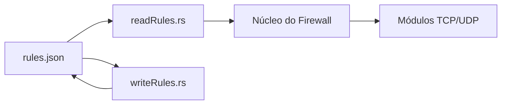
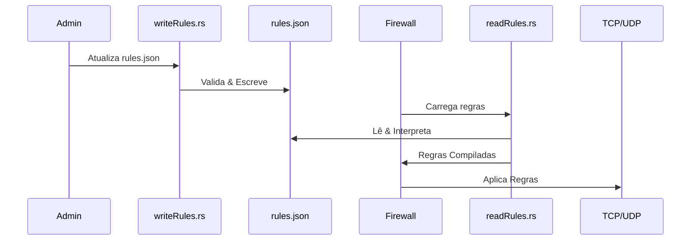

# Sistema de Regras do Firewall

## 📜 Visão Geral do Sistema de Regras

Este mecanismo de regras oferece controle granular sobre tráfego TCP e UDP com capacidades avançadas de filtragem. O sistema utiliza um formato de configuração baseado em JSON para máxima flexibilidade e facilidade de manutenção.

## 📂 Estrutura de Diretórios

```
firewall/
└── Rules/
    ├── readRules.rs      # Leitor e carregador de regras
    ├── writeRules.rs     # Compilador e validador de regras  
    └── rules.json        # Arquivo principal de configuração
```

## 🛡️ Arquitetura das Regras



## ⚙️ Configuração das Regras

### 📝 Estrutura do Schema JSON

```json
{
  "regras_tcp": {
    "portas_permitidas": [80, 443, 22],
    "protecao_get": {
      "tamanho_max_url": 2048,
      "padroes_bloqueados": ["../", "exec("]
    }
  },
  "regras_udp": {
    "interfaces_permitidas": ["eth0", "vpn0"],
    "corrupcao_dados": {
      "ativo": true,
      "padroes": ["token=", "senha="]
    }
  }
}
```

## 🚀 Exemplos de Uso

### Carregando Regras
```rust
// Exemplo do readRules.rs
let regras = carregar_regras("firewall/Rules/rules.json")?;
```

### Escrevendo Regras
```rust
// Exemplo do writeRules.rs
atualizar_regras("firewall/Rules/rules.json", novas_regras)?;
```

## 🔍 Fluxo de Processamento



## 📌 Melhores Práticas

1. **Organização**:
   - Agrupe regras relacionadas
   - Use comentários no JSON para regras complexas
   - Mantenha histórico de versões

2. **Validação**:
   ```bash
   cargo run --bin validar_regras -- rules.json
   ```

3. **Performance**:
   - Pré-compile padrões complexos
   - Use estruturas de dados eficientes
   - Limite condições aninhadas

## ⚠️ Considerações de Segurança

1. **Permissões**:
   ```bash
   chmod 600 rules.json
   chown root:root rules.json
   ```

2. **Verificação de Integridade**:
   ```rust
   fn verificar_assinatura(path: &str) -> Result<()> {
       // Implementação omitida
   }
   ```

3. **Backup**:
   ```bash
   cp rules.json rules.json.bak
   ```

## 🤝 Diretrizes para Contribuição

1. **Mudanças nas Regras**:
   - Documente cada nova regra
   - Inclua casos de teste
   - Atualize a validação do schema

2. **Testes**:
   ```bash
   cargo test --package firewall --test testes_regras
   ```

3. **Processo de Revisão**:
   - Todas as mudanças requerem revisão de segurança
   - Devem passar nos testes de CI
   - Compatibilidade retroativa obrigatória

---

**Aviso Importante**: Sempre teste mudanças de regras em ambiente de staging antes de implantar em produção. Use a flag `--dry-run` para verificar a aplicação das regras sem afetar o tráfego real.