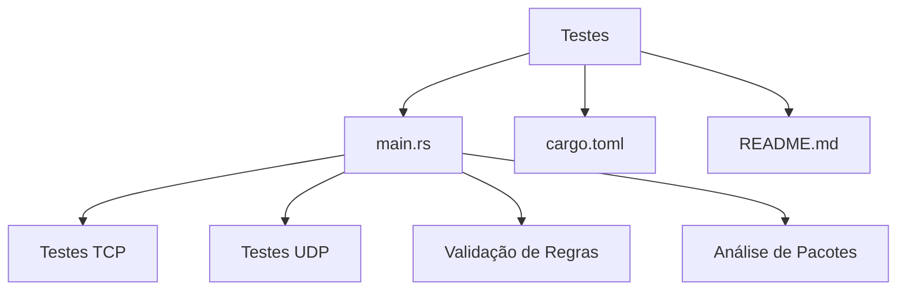
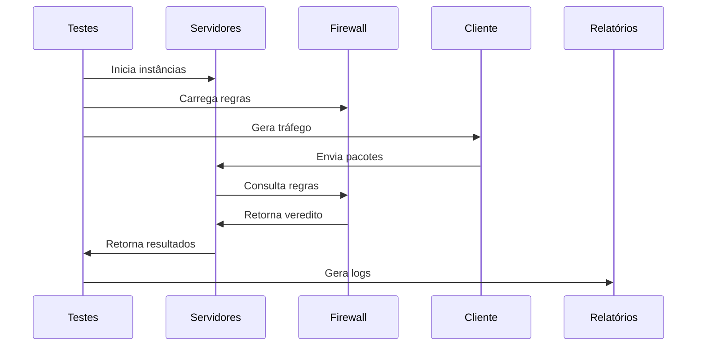

# Suíte de Testes para Firewall

## 📂 Visão Geral do Diretório de Testes

Este diretório contém testes abrangentes para a implementação do firewall TCP/UDP, incluindo validação de servidores, aplicação de regras e ferramentas de análise de pacotes.



## 🚀 Começando

### Pré-requisitos
- Rust 1.60+
- Cargo
- Docker (para testes de container)

## 🔧 Como Usar

### 1. Iniciando os Servidores de Teste

```bash
# Iniciar servidor TCP
cargo run --bin tcp_server

# Iniciar servidor UDP 
cargo run --bin udp_server

# Iniciar ambos (em terminais separados)
./scripts/start_servers.sh
```

### 2. Aplicando Regras

#### Regras Gerais (rules.json):
```json
{
  "tcp": {
    "allowed_ports": [80, 443, 8080],
    "blocked_ips": ["10.0.0.5"]
  },
  "udp": {
    "rate_limit": "1000/60s",
    "max_packet_size": 512
  }
}
```

#### Regras Dedicadas (test/rules/custom.rules):
```rust
// Exemplo para TCP
fn custom_tcp_rule(packet: &TcpPacket) -> Verdict {
    if packet.dst_port == 3306 {
        Verdict::Block("MySQL não permitido".into())
    } else {
        Verdict::Allow
    }
}
```

### 3. Executando Testes

```bash
# Todos os testes
cargo test

# Apenas testes TCP
cargo test tcp_

# Apenas testes UDP
cargo test udp_

# Testes com output detalhado
cargo test -- --nocapture
```

## 🔍 Verificação de Funcionalidades

### Testes Automatizados Incluem:

1. **Testes de Conectividade Básica**
   ```rust
   #[test]
   fn test_tcp_connect() {
       assert!(tcp_connect("127.0.0.1:8080").is_ok());
   }
   ```

2. **Testes de Regras**
   ```rust
   #[test]
   fn test_block_port_22() {
       let packet = mock_tcp_packet(dst_port: 22);
       assert_eq!(check_rules(packet), Verdict::Block);
   }
   ```

3. **Testes de Performance**
   ```rust
   #[bench]
   fn bench_packet_processing(b: &mut Bencher) {
       b.iter(|| process_packet(test_packet()));
   }
   ```

## 🛠 Troubleshooting

### Problemas Comuns e Soluções:

1. **Servidor não responde**
   - Verifique se o serviço está rodando:
     ```bash
     netstat -tulnp | grep 8080
     ```
   - Teste conectividade manual:
     ```bash
     telnet 127.0.0.1 8080  # TCP
     nc -u 127.0.0.1 8081   # UDP
     ```

2. **Regras não sendo aplicadas**
   - Verifique se o arquivo de regras foi carregado:
     ```rust
     println!("{:?}", load_rules());
     ```
   - Teste regras individualmente:
     ```bash
     cargo test rule_validation
     ```

3. **Problemas de performance**
   - Habilite logging detalhado:
     ```bash
     RUST_LOG=debug cargo run
     ```
   - Verifique métricas:
     ```bash
     curl http://127.0.0.1:9090/metrics
     ```

## 🔬 Análise Bit-a-Bit

### Como inspecionar pacotes:

1. **Via código de teste**:
```rust
let packet = receive_packet();
println!("Hex dump:");
print_hex(&packet);
println!("Binary view:");
print_binary(&packet);
```

2. **Via linha de comando**:
```bash
# Capturar pacotes de teste
cargo run --bin packet_sniffer > packet_dump.bin

# Analisar com xxd
xxd -b packet_dump.bin  # Binário
xxd -g1 packet_dump.bin # Hexadecimal
```

## 🧩 Comunicação Entre Arquivos



## ⚙️ Alterando Configurações

### Modificações Seguras:

1. **Adicionar novas regras**:
   - Edite `rules.json` ou adicione arquivos em `test/rules/`
   - Atualize os validadores correspondentes

2. **Mudar parâmetros de rede**:
   ```rust
   // Em config/network.rs
   pub const MAX_TCP_CONNECTIONS: usize = 1000;
   pub const UDP_TIMEOUT: Duration = Duration::from_secs(5);
   ```

3. **Adicionar novos testes**:
   - Crie arquivos em `test/cases/`
   - Atualize `main.rs` para incluir novos módulos

## 📊 Métricas e Monitoramento

Acesse as métricas em tempo real:
```bash
curl http://127.0.0.1:9090/metrics
```

Principais métricas disponíveis:
- `firewall_packets_processed_total`
- `firewall_rules_evaluated_total`
- `firewall_tcp_connections_active`
- `firewall_udp_packets_rate`

## 📌 Exemplo Completo

```rust
// test/cases/tcp_http.rs
#[test]
fn test_http_allowed() {
    let server = TestServer::new("tcp");
    let client = TestClient::connect(server.addr());
    
    let response = client.send(http_request());
    assert!(response.status().is_success());
    
    let packets = server.capture_packets();
    assert!(packets.iter().all(|p| p.allowed()));
}
```

Este README será atualizado conforme novas funcionalidades forem adicionadas ao sistema de testes.
Ultima atualização 15/05/2025