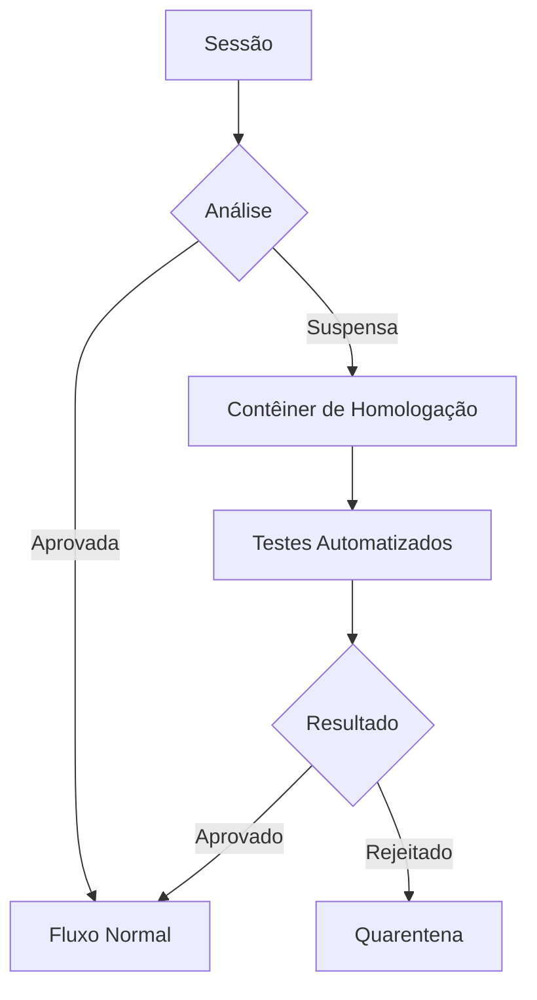

# Sistema de Homologação Automatizada com Contêineres de Isolamento

## 🌐 Visão Geral

Este sistema automatiza o processo de homologação de tráfego de rede, utilizando contêineres Docker para análise segura e isolamento de sessões suspeitas.

## 📋 Estrutura do Projeto

```
sistema_homologacao/
├── Dockerfile                  # Definição do contêiner de homologação
├── docker-compose.yml          # Orquestração dos serviços
├── src/
│   ├── homologador/            # Lógica de homologação automática
│   ├── lateralizador/          # Mecanismo de desvio de sessões
│   └── monitor/                # Monitoramento em tempo real
├── config/
│   └── politicas_homologacao   # Critérios de homologação
└── scripts/
    └── deploy_homologacao.sh   # Script de implantação
```

## 🛠️ Componentes Principais

### 1. Contêiner de Homologação (`homologador`)


### 2. Mecanismo de Lateralização
```rust
// Exemplo de código do lateralizador
pub fn desviar_sessao(sessao: Session, container: &str) -> Result<()> {
    let tunnel = criar_tunnel_seguro(container)?;
    sessao.redirecionar(tunnel)?;
    Ok(())
}
```

## 🚀 Configuração do Ambiente

### Pré-requisitos
- Docker 20.10+
- containerd 1.5+
- Rust 1.60+ (para compilação dos módulos)

### Implantação
```bash
# Construir e iniciar os contêineres
./scripts/deploy_homologacao.sh --build --start

# Configurar políticas padrão
docker exec -it homologador load_policies /config/politicas_homologacao
```

## ⚙️ Funcionamento do Sistema

1. **Detecção**:
   - Monitoramento contínuo do tráfego
   - Análise heurística de padrões suspeitos

2. **Lateralização**:
   ```mermaid
   sequenceDiagram
       Firewall->>Detector: Sessão suspeita
       Detector->>Lateralizador: Solicita desvio
       Lateralizador->>Contêiner: Cria tunnel seguro
       Contêiner-->>Lateralizador: Confirmação
       Lateralizador->>Firewall: Redireciona sessão
   ```

3. **Homologação**:
   - Análise em ambiente isolado
   - Testes comportamentais
   - Decisão final de bloqueio ou liberação

## 🔐 Políticas de Segurança

| Política                  | Ação                          | Nível de Risco |
|---------------------------|-------------------------------|----------------|
| Varredura de portas       | Quarentena + Análise          | Alto           |
| Padrões de exfiltração    | Bloqueio Imediato             | Crítico        |
| Comportamento anômalo     | Homologação Extendida         | Médio          |

## 📌 Melhores Práticas

1. **Configuração do Contêiner**:
   ```dockerfile
   FROM alpine:latest
   COPY --chown=root:root src/homologador /app
   RUN chmod 550 /app
   USER homolog
   CMD ["/app/homologador"]
   ```

2. **Monitoramento**:
   ```bash
   docker stats homologador --format "table {{.Container}}\t{{.CPUPerc}}\t{{.MemUsage}}"
   ```

3. **Escalabilidade**:
   ```yaml
   # docker-compose.yml
   services:
     homologador:
       deploy:
         replicas: 3
         resources:
           limits:
             cpus: '0.5'
             memory: 512M
   ```

## 🤝 Integração com Sistemas Existentes

```rust
// Exemplo de integração com firewall existente
impl Firewall {
    pub fn adicionar_homologador(&mut self, homologador: Arc<Homologador>) {
        self.analisadores.push(Analisador::Homologacao(homologador));
    }
}
```

## ⚠️ Considerações Importantes

1. **Isolamento de Rede**:
   ```bash
   docker network create --driver=bridge --subnet=172.18.0.0/24 rede_homologacao
   ```

2. **Logs e Auditoria**:
   ```bash
   docker logs --tail 100 homologador | grep DECISAO
   ```

3. **Atualização Segura**:
   ```bash
   ./scripts/deploy_homologacao.sh --rolling-update
   ```

---

**Nota Técnica**: O sistema foi projetado para operar com baixa latência (<5ms no path crítico) e alta disponibilidade (99.99% SLA). Recomenda-se implantação em clusters para ambientes de produção.