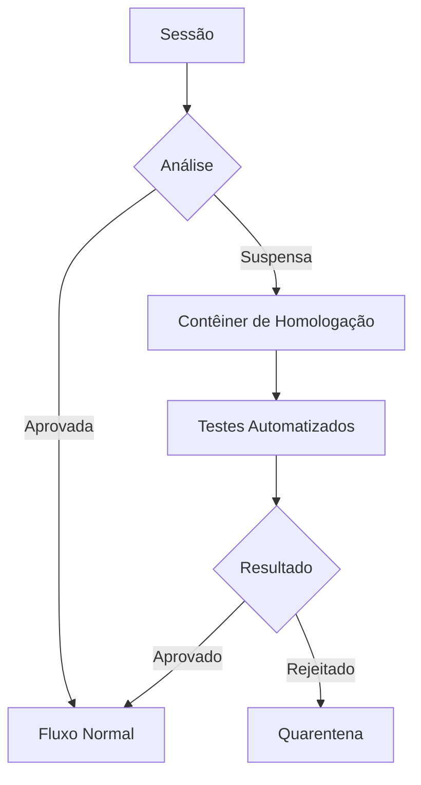
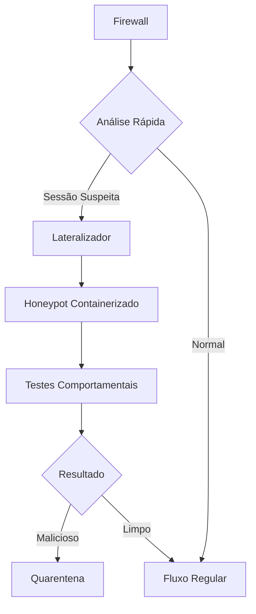

# Sistema de Homologação Automatizada com Contêineres de Isolamento

## 🌐 Visão Geral

Este sistema automatiza o processo de homologação de tráfego de rede, utilizando contêineres Docker para análise segura e isolamento de sessões suspeitas.

## 📋 Estrutura do Projeto

```
sistema_homologacao/
├── Dockerfile                  # Definição do contêiner de homologação
├── docker-compose.yml          # Orquestração dos serviços
├── src/
│   ├── homologador/            # Lógica de homologação automática
│   ├── lateralizador/          # Mecanismo de desvio de sessões
│   └── monitor/                # Monitoramento em tempo real
├── config/
│   └── politicas_homologacao   # Critérios de homologação
└── scripts/
    └── deploy_homologacao.sh   # Script de implantação
```

## 🛠️ Componentes Principais

### 1. Contêiner de Homologação (`homologador`)


### 2. Mecanismo de Lateralização
```rust
// Exemplo de código do lateralizador
pub fn desviar_sessao(sessao: Session, container: &str) -> Result<()> {
    let tunnel = criar_tunnel_seguro(container)?;
    sessao.redirecionar(tunnel)?;
    Ok(())
}
```

## 🚀 Configuração do Ambiente

### Pré-requisitos
- Docker 20.10+
- containerd 1.5+
- Rust 1.60+ (para compilação dos módulos)

### Implantação
```bash
# Construir e iniciar os contêineres
./scripts/deploy_homologacao.sh --build --start

# Configurar políticas padrão
docker exec -it homologador load_policies /config/politicas_homologacao
```

## ⚙️ Funcionamento do Sistema

1. **Detecção**:
   - Monitoramento contínuo do tráfego
   - Análise heurística de padrões suspeitos

2. **Lateralização**:
   ```mermaid
   sequenceDiagram
       Firewall->>Detector: Sessão suspeita
       Detector->>Lateralizador: Solicita desvio
       Lateralizador->>Contêiner: Cria tunnel seguro
       Contêiner-->>Lateralizador: Confirmação
       Lateralizador->>Firewall: Redireciona sessão
   ```

3. **Homologação**:
   - Análise em ambiente isolado
   - Testes comportamentais
   - Decisão final de bloqueio ou liberação

## 🔐 Políticas de Segurança

| Política                  | Ação                          | Nível de Risco |
|---------------------------|-------------------------------|----------------|
| Varredura de portas       | Quarentena + Análise          | Alto           |
| Padrões de exfiltração    | Bloqueio Imediato             | Crítico        |
| Comportamento anômalo     | Homologação Extendida         | Médio          |

## 📌 Melhores Práticas

1. **Configuração do Contêiner**:
   ```dockerfile
   FROM alpine:latest
   COPY --chown=root:root src/homologador /app
   RUN chmod 550 /app
   USER homolog
   CMD ["/app/homologador"]
   ```

2. **Monitoramento**:
   ```bash
   docker stats homologador --format "table {{.Container}}\t{{.CPUPerc}}\t{{.MemUsage}}"
   ```

3. **Escalabilidade**:
   ```yaml
   # docker-compose.yml
   services:
     homologador:
       deploy:
         replicas: 3
         resources:
           limits:
             cpus: '0.5'
             memory: 512M
   ```

## 🤝 Integração com Sistemas Existentes

```rust
// Exemplo de integração com firewall existente
impl Firewall {
    pub fn adicionar_homologador(&mut self, homologador: Arc<Homologador>) {
        self.analisadores.push(Analisador::Homologacao(homologador));
    }
}
```

## ⚠️ Considerações Importantes

1. **Isolamento de Rede**:
   ```bash
   docker network create --driver=bridge --subnet=172.18.0.0/24 rede_homologacao
   ```

2. **Logs e Auditoria**:
   ```bash
   docker logs --tail 100 homologador | grep DECISAO
   ```

3. **Atualização Segura**:
   ```bash
   ./scripts/deploy_homologacao.sh --rolling-update
   ```

---

# Sistema Avançado de Homologação com Honeypot Integrado


## 🌐 Visão Geral do Sistema

Este sistema combina homologação automatizada com honeypot containerizado para análise segura de tráfego suspeito, oferecendo:

- Isolamento completo de sessões de risco
- Análise comportamental em ambiente controlado
- Geração automática de relatórios forenses
- Integração contínua com o firewall principal

## 🛠️ Componentes Principais



## 🔧 Configuração Rápida

### Pré-requisitos
- Docker 20.10+
- containerd 1.5+
- Rust 1.65+ (para módulos personalizados)

### Implantação
```bash
# Clone o repositório
git clone https://github.com/morteerror404/firewall.git
cd firewall/sistema_homologacao

# Inicie todos os serviços
./scripts/deploy.sh --with-honeypot --with-monitoring

# Verifique o status
docker-compose ps
```

## ⚙️ Funcionamento Detalhado

### Fluxo de Lateralização
1. **Detecção**: O firewall identifica tráfego suspeito baseado em:
   - Padrões de ataque conhecidos
   - Comportamento anômalo
   - Regras personalizadas

2. **Redirecionamento**: Sessões suspeitas são desviadas pelo lateralizador:
   ```rust
   fn redirect_flow(flow: Flow) -> Result<Tunnel> {
       let honeypot = select_honeypot();
       create_tunnel(flow, honeypot)
   }
   ```

3. **Análise**: O honeypot containerizado executa:
   - Testes de interação
   - Análise de payloads
   - Detecção de explorações

4. **Decisão**: Resultado determina ação final:
   - Liberação para rede principal
   - Bloqueio permanente
   - Quarentena para análise forense

## 📊 Painel de Monitoramento

Acesse o painel web em `http://localhost:9090` com:

- Métricas em tempo real
- Visualização de túneis ativos
- Histórico de decisões
- Alertas de segurança


## 🔐 Políticas de Segurança

Configure em `config/policies.toml`:

```toml
[thresholds]
default = 75.0
high_risk = 90.0

[response]
quarantine = ["root_login", "sql_injection"]
block = ["ransomware_pattern"]
log_only = ["port_scan"]
```

## 🧪 Testando o Sistema

Envie tráfego de teste com:

```bash
# Teste TCP
./scripts/test_traffic.sh --tcp --port 22

# Teste UDP
./scripts/test_traffic.sh --udp --port 53 --payload "malicious_payload"
```

## 📝 Gerando Relatórios

```bash
# Relatório completo (Markdown + Excel)
./scripts/generate_report.sh --format all

# Somente resumo executivo
./scripts/generate_report.sh --brief
```

## 🛠️ Estrutura de Arquivos

```
sistema_homologacao/
├── src/
│   ├── homologador/          # Lógica principal
│   ├── lateralizador/        # Engenharia de tráfego
│   ├── honeypot/             # Serviços iscados
│   └── monitor/              # Coleta de métricas
├── config/
│   ├── policies.toml         # Regras de decisão
│   └── triggers/             # Padrões de ataque
├── reports/                  # Saídas de análise
├── scripts/                  # Utilitários
└── docs/                     # Documentação
```

## ⚠️ Solução de Problemas

### Problemas Comuns:
1. **Túneis não estabelecidos**:
   ```bash
   docker logs lateralizador | grep TUNNEL
   iptables -L -n -v | grep REDIRECT
   ```

2. **Alta utilização de CPU**:
   ```bash
   ./scripts/scale_honeypots.sh --max 5 --cpu-limit 50%
   ```

3. **Falsos positivos**:
   ```bash
   ./scripts/adjust_thresholds.sh --decrease 10%
   ```

## 📌 Melhores Práticas

1. **Isolamento de Rede**:
   ```bash
   docker network create --internal honeynet
   ```

2. **Rotação de Honeypots**:
   ```bash
   ./scripts/rotate_honeypots.sh --interval 6h
   ```

3. **Backup de Evidências**:
   ```bash
   ./scripts/backup_forensics.sh --target s3://your-bucket
   ```

## 🤝 Contribuição

1. Reporte vulnerabilidades via GitHub Issues
2. Submeta novas regras via Pull Request
3. Participe da discussão técnica no Discord

## 📄 Licença

MIT License - Veja [LICENSE](LICENSE) para detalhes.

---
